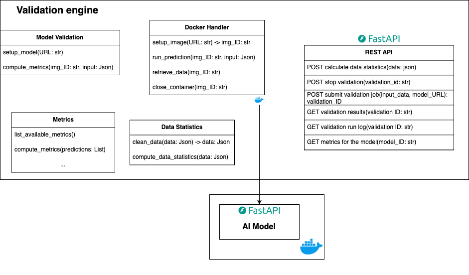

# ML Model Validator

Validator library for ML models.


[](https://python-poetry.org/)

This is the backend of the FAIRmodels-validator project. It is a library that validates FAIR models.

It is a REST API server built with FastAPI.
The architecture of the project is shown in the following diagram:



## Installation and running locally

Install the dependencies with
```bash
poetry install
```

The project requires Python 3.11. You can explicitly set the Python version (alternative to the previous command) with the following command:

```bash
poetry env use python3.11 && poetry install
```

Run the REST API server:

```bash
uvicorn src.FAIRmodels-validator.api_controller:app --reload
```

The server will be running on [http://localhost:8000](http://localhost:8000). You can access the API documentation at [http://localhost:8000/docs](http://localhost:8000/docs).